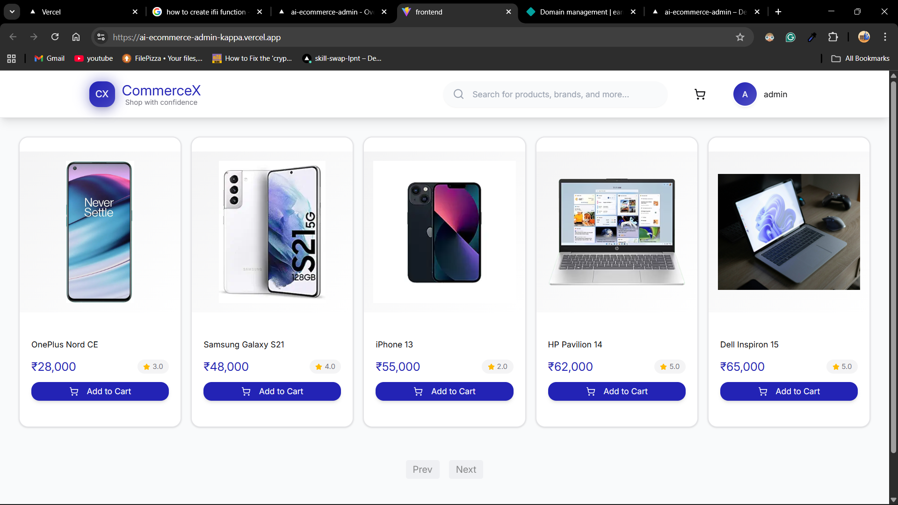
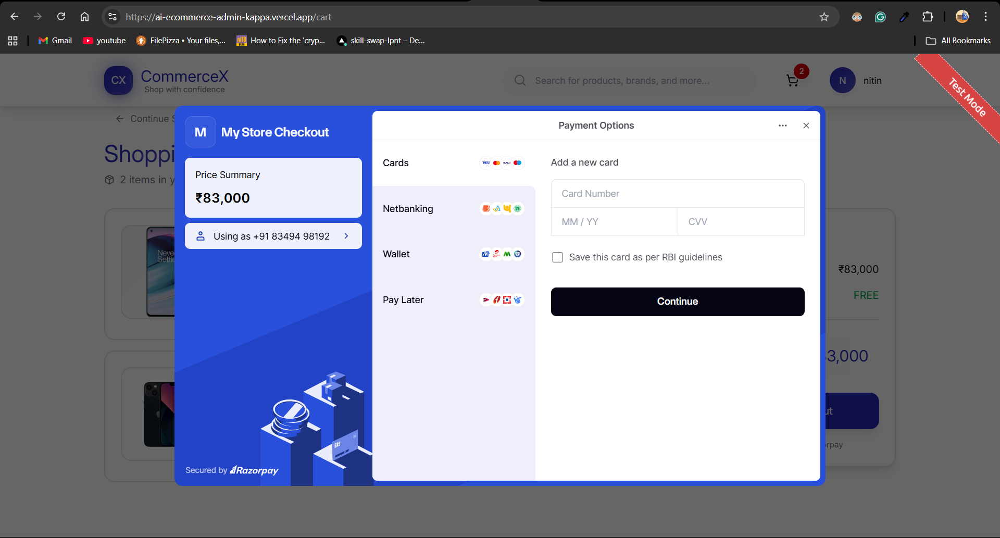
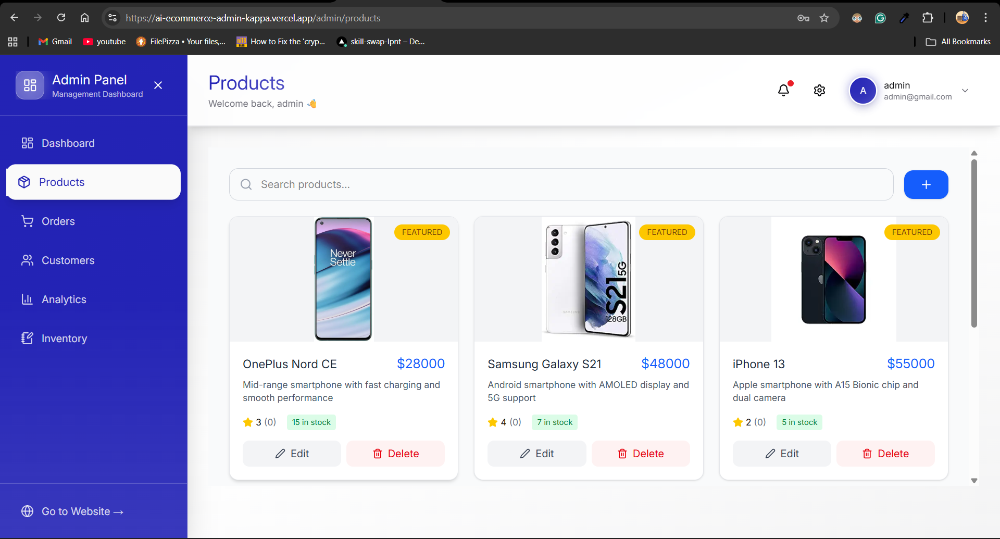

# CommerceX 🛒

CommencX is a full-stack **MERN e-commerce application** built with **TypeScript** on both frontend and backend.  
It supports secure authentication, product browsing, cart & checkout flow, **Razorpay (Live) payments**, order management, and a powerful **admin dashboard with analytics**.

🚀 The project is deployed and actively evolving with plans to add AI-powered features.

---

## 🌐 Live Links

- **Frontend (Vercel):** https://ai-ecommerce-admin-kappa.vercel.app/
- **Backend (Render):** https://ai-ecommerce-gyiq.onrender.com
- **GitHub Repository:** https://github.com/Niteshbakhla/Ai-Ecommerce.git

---

## 🚀 Features

### 👤 User Features
- Email & password authentication
- Role-based access (User / Admin)
- Browse products with pagination
- Product reviews & ratings
- Add to cart & manage cart
- Secure checkout flow
- Razorpay payment integration (Test + Live)
- Order creation & order history
- Similar product recommendations
- Image uploads via Cloudinary

---

### 🛠 Admin Features
- Admin authentication & authorization
- Product CRUD (Create, Read, Update, Delete)
- Inventory management
- View & manage all orders
- Sales overview
- Analytics dashboard with graphs
- Review & product insights

---

## 🛠 Tech Stack

### Frontend
- React
- TypeScript
- TanStack Query
- Redux
- Tailwind CSS
- shadcn/ui component library

### Backend
- Node.js
- Express.js
- TypeScript
- JWT Authentication
- Role-based authorization

### Database
- MongoDB

### Other Integrations
- Razorpay (Live Payments)
- Cloudinary (Image Uploads)

---

## 📸 Screenshots




 


---

## ⚙️ Installation & Setup

### Prerequisites
- Node.js
- MongoDB
- Razorpay account
- Cloudinary account

---

### Run Locally

1. Clone the repository
```bash
git clone https://github.com/Niteshbakhla/Ai-Ecommerce.git
````

2. Install backend dependencies

```bash
cd backend
npm install
```

3. Install frontend dependencies

```bash
cd frontend
npm install
```

4. Create a `.env` file inside the `backend` folder

```env
MONGO_URI=your_mongodb_connection_string
JWT_SECRET=your_jwt_secret

RAZORPAY_KEY_ID=your_razorpay_key_id
RAZORPAY_KEY_SECRET=your_razorpay_key_secret

CLOUDINARY_CLOUD_NAME=your_cloudinary_name
CLOUDINARY_API_KEY=your_cloudinary_key
CLOUDINARY_API_SECRET=your_cloudinary_secret
```

5. Start the application

```bash
npm run dev
```

---
## 🚧 Project Status

🟡 **In Progress**

The core features are completed and deployed.
Planned future enhancements include:

* Google authentication
* AI chatbot for customer support
* Advanced AI-based product recommendations
* More admin analytics & insights

---

## 👤 Author

**Nitesh Bakhla**

* GitHub: [https://github.com/Niteshbakhla](https://github.com/Niteshbakhla)

---

## ⭐ Support

If you like this project, consider giving it a ⭐ on GitHub!

```
